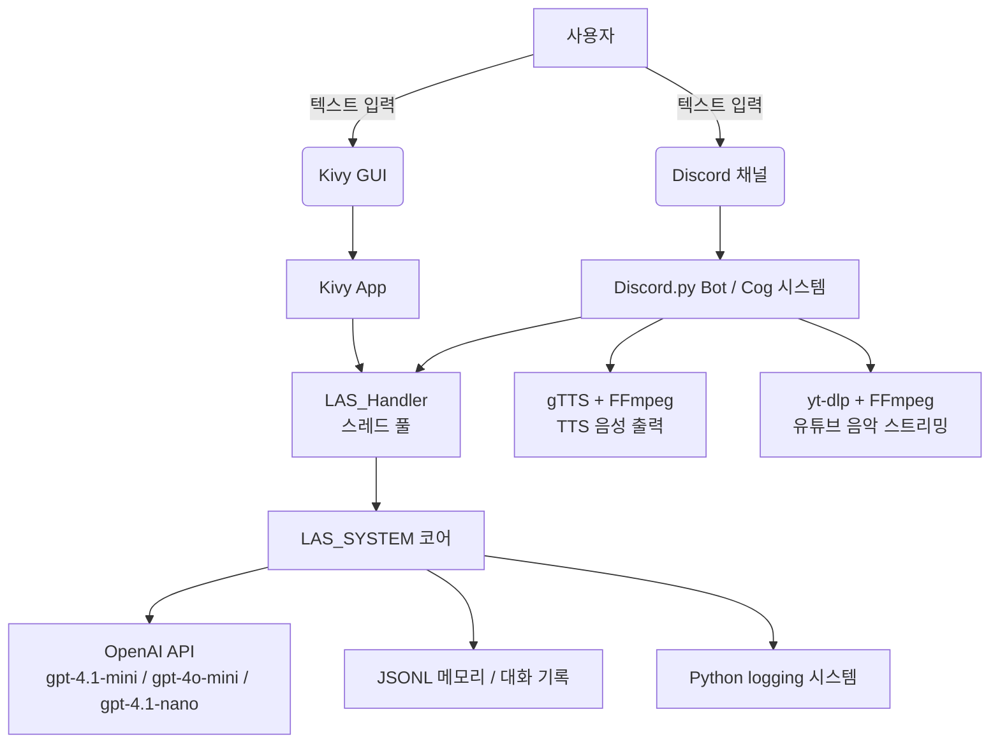

# L.A.S. (Listro AI System) 기술 분석 보고서

> **작성일**: 2026-03-17  
> **분석 대상**: [Project](../..)

---

## 1. 프로젝트 개요

L.A.S.(Listro AI System)는 **Discord 봇**과 **데스크탑 GUI**를 동시 인터페이스로 제공하는 개인 AI 비서 시스템이다. OpenAI의 대형 언어 모델(LLM)을 핵심 두뇌로 삼아, 대화·기억·요약·음악 재생·TTS 등의 기능을 통합한다.

---

## 2. 기술 스택 전체 구조



---

## 3. 핵심 기술 상세 분석

### 3-1. AI 엔진 — OpenAI API (`openai` 패키지)

| 모델 | 용도 | 파일 |
|---|---|---|
| `gpt-4.1-mini` | 메인 대화 응답 생성 | `LAS.py` → `talking_LAS()` |
| `gpt-4o-mini` | 요청 의도 판단 (Judge) | `LAS.py` → `judge()` |
| `gpt-4.1-nano` | 대화 요약 / 기억 추출 (경량) | `LAS.py` → `summary()`, `make_memory()` |

**주목할 점:**
- 역할별로 **다른 모델**을 의도적으로 선택해 비용과 품질을 최적화.
- System Prompt를 `Python string.Template`으로 관리해 `$REFERENCE`, `$MEMORY`, `$SUMMARY` 등의 변수를 동적으로 주입.
- LLM 응답에서 `<thinking>` 태그와 JSON을 파싱하는 전처리 레이어(`extract_json_from_llm_response`)가 존재 → **Chain-of-Thought 추론** 방식을 활용함을 시사.

---

### 3-2. 인터페이스 레이어

#### A. Discord 봇 — `discord.py` + `Cog` 아키텍처

- `discord.ext.commands.Bot`을 상속한 `MySuperBot` 클래스 사용.
- 기능이 **Cog(모듈)**로 분리되어 유지보수성 확보:

| Cog | 역할 |
|---|---|
| `LAS_Cog` | 대화 처리, TTS 제어 |
| `admin_kivy` | 관리자 명령어 |
| `music_kivy` | 유튜브/로컬 음악 재생 |
| `tts_kivy` | TTS 독립 기능 |
| `voice_room_kivy` | 음성 채널 관리 |

#### B. 데스크탑 GUI — `Kivy` 프레임워크

- `kivy.app.App`을 상속한 `LAS_GUI_App`에서 봇과 GUI를 **동시에 실행**.
- UI 레이아웃은 별도의 `las_gui_.kv` (Kivy Language) 파일로 분리.
- `kivy.clock.Clock.schedule_once()`를 활용해 백그라운드 스레드의 결과를 **메인 UI 스레드에 안전하게 전달**.

---

### 3-3. 비동기·병렬 처리 아키텍처

> [!IMPORTANT]
> L.A.S.의 가장 핵심적인 설계 결정 중 하나. Kivy(동기)와 Discord.py(비동기) 두 프레임워크를 단일 프로세스에서 함께 운용하기 위해 정교한 스레딩 설계가 필요했다.

| 기술 | 역할 |
|---|---|
| `threading.Thread` | Discord 봇의 이벤트 루프를 별도 스레드에서 실행 |
| `asyncio` | Discord 봇 내 비동기 이벤트 처리 |
| `concurrent.futures.ThreadPoolExecutor` | LAS AI 호출을 백그라운드 스레드 풀에서 처리 (기본 5개 워커) |
| `asyncio.run_coroutine_threadsafe()` | 다른 스레드에서 비동기 루프에 작업 안전하게 제출 |

흐름 요약:
```
[Kivy 메인 스레드] → LAS_Handler.request_response()
                    → ThreadPoolExecutor (백그라운드)
                         → LAS.process() → OpenAI API 호출
                    → 콜백(Clock.schedule_once) → [Kivy UI 스레드 업데이트]
```

---

### 3-4. 기억(Memory) 및 대화 관리 시스템

**JSONL(JSON Lines)** 형식을 자체 데이터베이스로 사용:

| 파일 | 내용 |
|---|---|
| `Talking_history.jsonl` | 모든 대화 원본 기록 (`role`, `name`, `content`) |
| `Summary_history.jsonl` | 대화 요약본 누적 저장 |
| `{name}_memory.jsonl` | 사용자별 장기 기억 (`facts` 리스트) |
| `LAS_memory.jsonl` | L.A.S. 자신의 기억 |

- `control_jsonl.py`에 JSONL 유틸리티 함수(`get_last_n_lines`, `get_x_dict` 등) 집중화.
- `collections.deque`를 이용해 메모리 효율적으로 마지막 N줄을 읽는 최적화 적용.
- 대화 흐름: **입력 → 기억 추출 → 의도 판단 → 롤 프롬프트 구성 → 응답 → 요약 → 기억 갱신**

---

### 3-5. 음성 기능

#### TTS (Text-to-Speech) — `gTTS`
- `gTTS(text, lang='ko')`로 한국어 텍스트를 MP3로 변환.
- 변환은 동기 함수이므로 `run_in_executor()`로 백그라운드 스레드에서 처리 → Discord 이벤트 루프 블로킹 방지.
- `discord.FFmpegPCMAudio`로 음성 채널에 재생.

#### 음악 스트리밍 — `yt-dlp` + `FFmpeg`
- `yt-dlp`로 유튜브 URL 또는 검색어 → 오디오 스트리밍 URL 추출.
- `FFmpegPCMAudio`에 재연결 옵션(`-reconnect`)을 적용해 네트워크 불안정 대응.
- 로컬 오디오 파일 재생도 함께 지원.

---

### 3-6. 로깅 시스템

- `log_module.py`에서 파이썬 표준 `logging` 모듈을 래핑한 `log` 클래스 구현.
- 로그 파일명은 **날짜(YYYYMMDD).log** 형식으로 자동 생성.
- `SystemLogger`, `DiscordLogger` 등 목적별 로거를 분리.
- 포매터에 `place` 필드를 추가 → 어느 모듈에서 발생한 로그인지 즉시 식별 가능.

---

### 3-7. 환경 변수 관리 — `python-dotenv`

- 모든 민감 정보(API 키, 파일 경로 등)를 `.env` 파일로 분리.
- 각 모듈 상단에서 `load_dotenv()`를 호출하는 방식으로 어디서든 안전하게 참조.

> [!WARNING]
> `.env` 파일에는 `OPENAI_API_KEY`, `BOT_TOKEN` 같은 민감 정보가 포함되어 있으므로 버전 관리 시 반드시 `.gitignore`에 추가되어야 한다.

---

## 4. 사용 기술 요약 테이블

| 분류 | 라이브러리/기술 | 버전 정책 | 목적 |
|---|---|---|---|
| **AI 엔진** | `openai` | gpt-4.1-mini 외 | LLM 기반 대화·판단·요약·기억 |
| **Discord 인터페이스** | `discord.py` | Cog 아키텍처 | 봇 이벤트 및 커맨드 처리 |
| **데스크탑 GUI** | `Kivy` | `.kv` 레이아웃 분리 | 관리자용 데스크탑 UI |
| **TTS** | `gTTS` | 한국어(`ko`) | AI 응답 음성화 |
| **음악 스트리밍** | `yt-dlp` | 스트리밍 전용 | 유튜브 오디오 스트리밍 |
| **오디오 처리** | `FFmpeg` | PCM 스트림 | 음성 채널 오디오 출력 |
| **비동기 처리** | `asyncio`, `threading`, `concurrent.futures` | 혼합 | 프레임워크 간 병렬 실행 |
| **데이터 저장** | `JSONL` (자체 구현) | `collections.deque` 최적화 | 대화 기록·요약·기억 관리 |
| **로깅** | Python `logging` (래핑) | 날짜별 파일 자동 분리 | 모듈별 시스템 로그 |
| **환경 변수** | `python-dotenv` | `.env` 파일 | API 키·경로 보안 관리 |
| **언어** | Python 3.12+ | f-string 중첩 사용 | 전체 구현 언어 |

---

## 5. 아키텍처 설계 특이점 및 평가

| 항목 | 내용 |
|---|---|
| **멀티모달 인터페이스** | Discord + Kivy GUI를 단일 프로세스에서 동시 운용 — 고난도 스레딩 설계 필요 |
| **모델 분리 전략** | 경량(nano) / 범용(mini) / 판단(4o-mini) 모델을 역할별로 명확히 구분 |
| **프롬프트 템플릿화** | `string.Template`으로 System Prompt를 동적 구성 — 확장성 확보 |
| **JSONL 자체 DB** | 외부 DB 없이 JSONL로 장기 기억 구현 — 간단하지만 규모 확장 시 한계 존재 |
| **Cog 아키텍처** | Discord 기능을 Cog로 모듈화 — 기능 추가·제거 용이 |
| **데코레이터 로깅** | `@input_record` 데코레이터로 호출 전 자동 로깅 — AOP 패턴 적용 |
