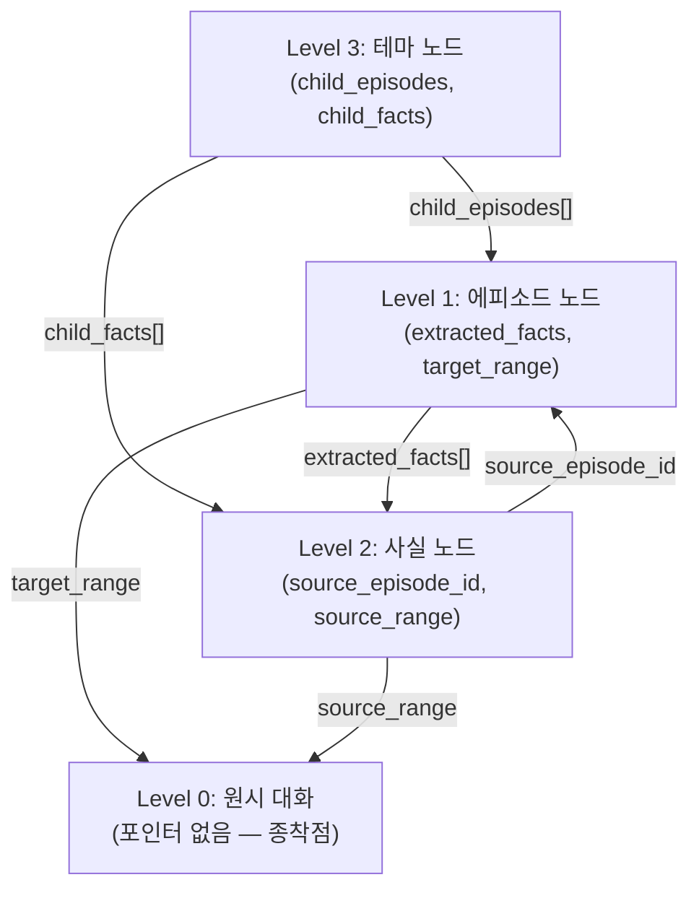

# L.A.S. xMemory 4-Layer Architecture — 설계 명세서 v2.0

> **작성일**: 2026-06-01  
> **설계자**: Listro  
> **대상 시스템**: L.A.S. (Listro AI System)  
> **목적**: 기존 JSONL 기반 3계층 메모리를 벡터 DB 기반 4계층 RAG 아키텍처로 전면 교체

---

## 목차

1. [설계 원칙 및 폐기 대상](#1-설계-원칙-및-폐기-대상)
2. [단기 기억 — 슬라이딩 윈도우](#2-단기-기억--슬라이딩-윈도우)
3. [장기 기억 — xMemory 4계층 구조](#3-장기-기억--xmemory-4계층-구조)
4. [응답 생성 파이프라인](#4-응답-생성-파이프라인)
5. [비동기 기억 통합 파이프라인](#5-비동기-기억-통합-파이프라인)
6. [수용된 한계점](#6-수용된-한계점)
7. [기존 시스템과의 매핑](#7-기존-시스템과의-매핑)

---

## 1. 설계 원칙 및 폐기 대상

### 핵심 설계 원칙

| 원칙 | 설명 |
|---|---|
| **원시 데이터 보존** | 요약에 의한 정보 손실을 거부. 원본 대화를 Level 0으로 영구 보관 |
| **인덱스-페이로드 분리** | 검색용 벡터(Index)와 프롬프트 주입용 데이터(Payload)를 엄격 분리 |
| **비동기 우선** | 메인 응답 루프를 차단하지 않는 백그라운드 기억 처리 |
| **하향식 고정 분류** | Level 3 테마를 사전 정의하여 분류 안정성 확보 |

### 폐기 대상 (기존 시스템)

| 폐기 항목 | 기존 파일 | 사유 |
|---|---|---|
| 중기 요약 (Rolling Summary) | [summary_history.jsonl](../../DATABASE/About_LAS/summary_history.jsonl) | 정보 손실 + API 지연 + None 연쇄 오류 |
| 평면 JSONL 사실 누적 | [LAS_memory.jsonl](../../DATABASE/About_LAS/Memory/LAS_memory.jsonl), `{name}_memory.jsonl` | 무한 누적 → 토큰 폭발 + 오염 불가역 |
| [summary()](../../MODULE/LAS.py#L181-L196) | `LAS.py` L181–196 | 중기 요약 폐기에 따라 삭제 |
| [make_memory()](../../MODULE/LAS.py#L212-L230) | `LAS.py` L212–230 | 비동기 통합 파이프라인으로 대체 |

---

## 2. 단기 기억 — 슬라이딩 윈도우

### 개요

```
┌─────────────────────────────────────────────────────────────┐
│                    Sliding Window Queue                     │
│  ┌────┬────┬────┬── ─ ─ ─ ─ ──┬────┬────┬────┬────┐        │
│  │ T₁ │ T₂ │ T₃ │    ...     │T₁₈ │T₁₉ │T₂₀ │ T₂₁│←NEW   │
│  └─┬──┴────┴────┴── ─ ─ ─ ─ ──┴────┴────┴────┴────┘        │
│    ↓ EVICT                                                  │
│  [WAL에 기록 → 비동기 통합 파이프라인으로 이관]                │
└─────────────────────────────────────────────────────────────┘
```

### 사양

| 속성 | 값 |
|---|---|
| **자료 구조** | `collections.deque(maxlen=N)` 기반 큐 |
| **윈도우 크기 (N)** | **20턴** (사용자 + 어시스턴트 각 1턴 = 1쌍) |
| **데이터 형태** | 요약 없는 **원시 텍스트(Raw Text)** |
| **프롬프트 주입 위치** | `messages` 배열 |
| **목적** | 대명사(대용어) 추론, 시계열적 문맥 보존, 즉각적 화제 전환 대응 |

### 운용 방식

1. 새로운 턴이 발생하면 큐의 끝(tail)에 추가
2. 큐가 `maxlen`을 초과하면 가장 오래된 턴이 head에서 **밀려남(evict)**
3. 밀려난 턴은 즉시 **WAL(Write-Ahead Log)**에 기록 → 비동기 통합 파이프라인으로 이관

> [!IMPORTANT]
> 기존 [get_history(num=8)](../../MODULE/LAS.py#L197-L210)의 JSONL 전체 파일 스캔 방식을 폐기하고, 인메모리 큐에서 직접 슬라이스하여 `messages` 배열에 주입합니다.

---

## 3. 장기 기억 — xMemory 4계층 구조

### 전체 구조도

```
┌──────────────────────────────────────────────────────────────────────────┐
│                      xMemory 4-Layer Architecture                        │
│                                                                          │
│  ┌───────────────────────────────────────────────────────────────┐       │
│  │  Level 3: 전역 테마 노드 (Themes / Groups)                    │       │
│  │  ───────────────────────────────────────────────────────────  │       │
│  │  [T_01] AI 연구          [T_02] 게임 개발                     │       │
│  │  [T_03] 아키텍처/HW      [T_04] SW 인프라                     │       │
│  │  [T_05] 창작/세계관      [T_06] 학업                          │       │
│  │  [T_07] 커리어/행정      [T_08] 게임 분석                     │       │
│  │  [T_09] 일상                                                 │       │
│  │  → 사전 하드코딩된 정적 카테고리 (벡터 공간 고정)               │       │
│  └──────────┬──────────────────────────────┬─────────────────────┘       │
│             │ child_episodes               │ child_facts               │
│   ┌─────────▼──────────┐        ┌──────────▼───────────┐               │
│   │  Level 1            │◄──────►│  Level 2              │              │
│   │  에피소드 맥락 노드   │ 양방향  │  국소 사실 노드        │              │
│   │  (Context Index)    │ 참조   │  (Facts/Components)   │              │
│   │                     │        │                       │              │
│   │  • 다차원 맥락 벡터   │ L1→L2: │  • 독립 사실 단문      │              │
│   │  • 주제/기술스택/결론 │ extract│  • Index + Payload    │              │
│   │  • L0 포인터 포함    │ ed_    │  • 모순/중복 제거      │              │
│   │                     │ facts[]│  • active/superseded  │              │
│   │                     │        │                       │              │
│   │                     │ L2→L1: │  • source_episode_id  │              │
│   │                     │ source_│    (상향 참조)         │              │
│   └────────┬────────────┘ episode└───────────┬───────────┘              │
│            │ target_range          source_range│                        │
│            │ (단방향)                (단방향)   │                        │
│   ┌────────▼────────────────────────────────────▼───────────┐           │
│   │  Level 0: 원시 대화 노드 (Raw Messages)                  │           │
│   │  ─────────────────────────────────────────────────────  │           │
│   │  • 가공되지 않은 원본  • 검색 불참여  • 최종 페이로드     │           │
│   │  • SQLite 저장  • 역방향 포인터 없음 (불변 종착점)        │           │
│   └──────────────────────────────────────────────────────────┘           │
└──────────────────────────────────────────────────────────────────────────┘

계층 간 연결 요약:
  L1 ◄──양방향──► L2    (extracted_facts[] ↔ source_episode_id)
  L1  ──단방향──► L0    (target_range → 종착점)
  L2  ──단방향──► L0    (source_range → 종착점)
  L0  ──────────► 없음  (불변 렛저, 역방향 포인터 없음)
```

### 계층별 상세 정의

---

#### Level 3 — 전역 테마 노드 (Themes / Groups)

| 속성 | 설명 |
|---|---|
| **역할** | 최상위 카테고리. 1단계 전역 검색(Global Search)의 진입점 |
| **데이터 형식 (Index)** | 하위 노드들을 포괄하는 군집의 의미론적 벡터 |
| **생성 방식** | 개발자가 **하드코딩**. 시스템 초기화 시 임베딩하여 벡터 공간 고정(Pinning) |
| **가변성** | **정적 (Immutable)** — 런타임 중 추가/삭제 없음 |

**사전 정의 카테고리 (9~10개):**

| ID | 테마명 | 설명 |
|---|---|---|
| `T_01` | AI 및 RAG 아키텍처 연구 | AI 모델, 임베딩, 검색 증강 생성 관련 |
| `T_02` | 게임 개발 (Unity 2D 등) | Unity, Dash Game, 타일맵, 충돌 처리 등 |
| `T_03` | 컴퓨터 아키텍처/하드웨어 | Verilog, CPU 설계, 하드웨어 관련 |
| `T_04` | 소프트웨어 인프라 | Java, 자료구조, 알고리즘, 소프트웨어 엔지니어링 |
| `T_05` | 창작/세계관 | 소설, 세계관 설계, 캐릭터 디자인 |
| `T_06` | 학업 | 수업, 과제, 시험, 학교 관련 |
| `T_07` | 커리어/행정 | 취업, 인턴, 행정 절차, 이력서 |
| `T_08` | 게임 분석 | 게임 플레이, 리뷰, 전략 분석 |
| `T_09` | 일상/취미/서브컬처 | 일반 대화, 취미, 서브컬처 |

**작동 로직:**
새로 추출된 Level 1 / Level 2 노드는 **코사인 유사도가 가장 높은** Level 3 테마에만 종속됩니다.

$$\text{assigned\_theme} = \arg\max_{k} \cos(\mathbf{v}_{node}, \mathbf{T}_k)$$

---

#### Level 2 — 국소 사실 노드 (Facts / Memory Components)

| 속성 | 설명 |
|---|---|
| **역할** | 대화에서 도출된 명확한 사실 관계. 상위 Level 3에 종속 |
| **데이터 형식** | 모순/중복이 제거된 **독립적 단문** |
| **이중 역할** | **Index (검색용 벡터)** + **Payload (프롬프트 주입)** 겸임 |
| **상태 관리** | `active` / `superseded` 상태 전이 지원 |

**메타데이터 구조:**
```json
{
  "id": "F_101",
  "text": "TreeMap은 정렬을 유지하므로 삽입 시 O(log n) 오버헤드가 발생함",
  "status": "active",
  "parent_theme_id": "T_04",
  "source_episode_id": "E_42",
  "source_range": [1050, 1072],
  "created_at": "2026-05-30T14:22:00+09:00",
  "supersedes": null,
  "superseded_by": null
}
```

---

#### Level 1 — 에피소드 맥락 노드 (Segments / Context Index)

| 속성 | 설명 |
|---|---|
| **역할** | 단기 윈도우에서 밀려난 원시 대화 뭉치를 대표하는 **검색용 색인(Index)** |
| **데이터 형식** | 백그라운드 LLM이 추출한 **정형화된 다차원 맥락** |
| **구성 요소** | 1) 핵심 주제, 2) 주요 고유명사/기술 스택, 3) 결론 상태 |
| **역할** | Level 0를 가리키는 메타데이터 포인터(`target_range`) 포함 |

**메타데이터 구조:**
```json
{
  "id": "E_42",
  "summary": "Java의 TreeMap vs HashMap 성능 비교 논의. 정렬 유지 필요 시 TreeMap, 아닐 시 HashMap 사용 결론.",
  "topics": ["Java", "TreeMap", "HashMap", "자료구조 성능"],
  "tech_stack": ["Java Collections Framework"],
  "conclusion": "정렬이 필요하지 않은 경우 HashMap이 O(1) 접근으로 우월",
  "parent_theme_id": "T_04",
  "extracted_facts": ["F_101", "F_102"],
  "target_range": [1050, 1072],
  "created_at": "2026-05-30T14:22:00+09:00"
}
```

---

#### Level 0 — 원시 대화 노드 (Raw Messages)

| 속성 | 설명 |
|---|---|
| **역할** | 검색 과정에 참여하지 않는 **최종 페이로드(Payload)** |
| **데이터 형식** | 가공되지 않은 순수한 대화 텍스트 뭉치 |
| **저장소** | SQLite (RDBMS) — 불변 단방향 렛저 |
| **호출 조건** | Level 1 인덱스 검색 시 메타데이터(`target_range`)를 통해 O(1) 로드 |

**스키마 (SQLite):**
```sql
CREATE TABLE raw_messages (
    turn_id    INTEGER PRIMARY KEY AUTOINCREMENT,
    timestamp  TEXT    NOT NULL,
    speaker    TEXT    NOT NULL,  -- 'user' | 'assistant'
    name       TEXT    NOT NULL,  -- 'Listro' | 'L.A.S.' 등
    content    TEXT    NOT NULL
);
-- 역방향 포인터 없음. 원본의 순수성과 I/O 속도 유지.
```

---

### 계층 간 포인터 구조 (엣지 방향 정리)



| 엣지 | 방향 | 유형 |
|---|---|---|
| L3 → L1 | 하향 | `child_episodes[]` 배열 |
| L3 → L2 | 하향 | `child_facts[]` 배열 |
| L1 → L2 | 하향 | `extracted_facts[]` 배열 |
| L1 → L0 | 하향 | `target_range` (단방향 종착점) |
| L2 → L1 | 상향 | `source_episode_id` |
| L2 → L0 | 하향 | `source_range` (단방향 종착점) |
| **L0 → 어디에도** | **없음** | **불변 렛저 — 역방향 포인터 없음** |

---

## 4. 응답 생성 파이프라인

### 전체 흐름도

```
사용자 요청 수신
       │
       ▼
 ┌─────────────┐
 │ 단기 윈도우  │  ← 최근 20턴 큐 업데이트
 │ 큐 업데이트  │
 └──────┬──────┘
        │
        ▼
 ┌──────────────────────────────────────────────────┐
 │  Phase 0: 의도 판별 (Intent Routing)              │
 │  경량 모델 또는 휴리스틱 → RAG 필요 여부 판별      │
 └──────┬─────────────────────────────┬──────────────┘
        │ RAG 필요                     │ RAG 불필요
        ▼                             │
 ┌──────────────────┐                  │
 │  Phase 1:         │                  │
 │  전역 검색        │                  │
 │  (Global Search)  │                  │
 │  q⃗ vs L3 테마들   │                  │
 └──────┬───────────┘                  │
        │ 임계치 초과 테마 필터링         │
        ▼                             │
 ┌──────────────────────┐               │
 │  Phase 2:             │               │
 │  국소 검색             │               │
 │  (Local Retrieval)    │               │
 │  L2 Top-K (주검색)     │               │
 │  + L2 연관 L1 일부     │               │
 └──────┬───────────────┘               │
        │                             │
        ▼                             ▼
 ┌──────────────────────────────────────────────────┐
 │  Phase 3: 1차 주입 및 생성 (1st Pass)              │
 │                                                    │
 │  messages: 단기 기억 윈도우 (최근 20턴 원시 대화)    │
 │                                                    │
 │  $MEMORY 구역:                                      │
 │  ┌──────────────────────────────────────────┐      │
 │  │ [확정된 사실]                              │      │
 │  │  Level 2 데이터 → 텍스트 원문 나열          │      │
 │  ├──────────────────────────────────────────┤      │
 │  │ [열람 가능한 과거 기록 목차]                 │      │
 │  │  Level 1 데이터 → [EP_ID]: 요약문 형태      │      │
 │  │  (데이터 존재 위치의 Map만 제공)            │      │
 │  └──────────────────────────────────────────┘      │
 │                                                    │
 │  도구: request_deep_search(target_episode, reason)  │
 └──────┬────────────────────────────┬────────────────┘
        │ 결과 A                      │ 결과 B
        │ (L2로 해결)                  │ (목차 타겟팅)
        ▼                            ▼
    응답 반환                ┌──────────────────┐
    (파이프라인 종료)         │  Phase 4:         │
                           │  타겟 심층 검색    │
                           │  (Deep Search)    │
                           │                   │
                           │  target_episode   │
                           │  → L0 O(1) 로드   │
                           │  → 2nd Pass 생성   │
                           └──────┬────────────┘
                                  ▼
                              최종 응답 반환
```

### Phase별 상세

---

#### Phase 0: 의도 판별 (Intent Routing)

- **목적**: 모든 질의에 벡터 검색을 수행하는 오버헤드 방지
- **실행 주체**: 기존 [judge()](../../MODULE/LAS.py#L165-L178)를 확장 (경량 모델 또는 휴리스틱/규칙 기반)
- **분기**:
  - 단순 인사/맞장구 → **Phase 3 직행** (RAG 생략)
  - 과거 정보 필요 → **Phase 1 진입**

---

#### Phase 1: 하향식 전역 검색 (Global Retrieval)

1. **요청 벡터화**: 사용자 요청 → 임베딩 모델 → 질의 벡터 **q⃗**
2. **Level 3 확인**: 사전 하드코딩된 Level 3 테마 벡터들과 코사인 유사도 계산
3. **필터링**: 임계치(threshold)를 넘는 상위 테마(예: `T_02 게임 개발`, `T_04 SW 인프라`)를 선별

---

#### Phase 2: 국소 검색 (Local Retrieval — L2 주검색 + L1 연관 탐색)

1. **Pre-filter**: Phase 1에서 필터링된 테마 ID를 메타데이터 조건으로 적용 → 검색 공간 축소
2. **Level 2 Top-K 검색 (주검색)**: 질의 벡터 **q⃗** vs 검색 공간 내의 **Level 2 (사실)** 벡터 간 유사도 계산 → 관련성 높은 사실 노드 **Top-K** 추출
3. **Level 1 연관 탐색 (부수 검색)**: Top-K로 추출된 Level 2 노드들의 `source_episode_id` 메타데이터를 역참조하여, **해당 사실이 도출된 에피소드(Level 1)**만 선별적으로 수집
4. **결과**: Level 2 Top-K = `[확정된 사실]`로 직접 주입, Level 1 연관 에피소드 = `[열람 가능한 과거 기록 목차]`로 목차 형태 주입

> [!NOTE]
> Level 1은 독립적으로 Top-K 검색되지 않습니다. Level 2의 검색 결과에 **종속적으로** 연관 에피소드만 추출되며, 이를 통해 모델에게 "이 사실이 나온 원래 대화가 어디에 있는지"에 대한 위치 정보(Map)만 제공합니다.

---

#### Phase 3: 1차 주입 및 생성 (1st Pass — 목차 주입 패턴)

**프롬프트 조립 (분리형 주입):**

| 구역 | 소스 | 주입 형태 |
|---|---|---|
| `messages` 배열 | 단기 기억 윈도우 | 최근 20턴 원시 대화 |
| `$MEMORY` — 확정 사실 | Level 2 | 텍스트 원문 나열 |
| `$MEMORY` — 과거 기록 목차 | Level 1 | `[EP_ID_XXX]: 요약문` 형태 (Map만 제공) |

**도구 제공:**
메인 모델(gpt-4.1-mini)에 `request_deep_search(target_episode: str, reason: str)` 도구를 활성화한 채로 1차 생성 요청.

**분기 (Waterfall Decision):**

| 결과 | 조건 | 동작 |
|---|---|---|
| **결과 A** | 모델이 단기 기억 + Level 2 사실만으로 해결 가능 판단 | 텍스트 응답 생성 → **파이프라인 종료** |
| **결과 B** | 모델이 목차를 보고 특정 에피소드에 해답 존재 판단 | `request_deep_search()` 도구 호출 → **Phase 4 진입** |

---

#### Phase 4: 타겟팅 심층 검색 및 2차 주입 (Targeted Deep Search & 2nd Pass)

1. **시스템 인터셉트**: 도구 호출 감지 → 대기 + 사용자에게 상태 메시지 비동기 출력  
   *"과거 기록을 심층 탐색 중입니다..."*
2. **Level 0 확정 로드**: `target_episode` ID → SQLite에서 해당 `target_range`의 원시 대화 **O(1) 로드**  
   ⚠️ 이 단계에서 추가 벡터 검색 **없음**
3. **2차 주입 및 생성**: 기존 프롬프트 하단에 Level 0 원시 데이터 덧붙여 메인 모델 **재호출(2nd Pass)**
4. **최종 응답 반환**

---

## 5. 비동기 기억 통합 파이프라인

### 트리거 조건

> 단기 슬라이딩 윈도우에서 **20턴 초과** 시 자동 실행

### 전체 흐름도

```
단기 윈도우 → 20턴 초과 → 대화 밀려남(evict)
       │
       ▼
 ┌──────────────────────────────────────────────────────┐
 │  Phase 1: 실시간 로깅 및 트리거                        │
 │                                                       │
 │  1. L0 단방향 기록 (SQLite APPEND)                     │
 │     [turn_id, timestamp, speaker, content]             │
 │  2. WAL(Write-Ahead Log) 기록                          │
 │  3. 오버랩 구간 설정 (밀려난 턴 + 잔존 2턴)              │
 │     예: turn_id 1050 ~ 1072                            │
 └──────────────┬───────────────────────────────────────┘
                │ 비동기 워커로 전달
                ▼
 ┌──────────────────────────────────────────────────────┐
 │  Phase 2: 구조화된 순차 추출 (2-Pass)                  │
 │                                                       │
 │  ┌─────────────────────────────────────────────┐     │
 │  │  Pass 1: Level 2 사실 추출                   │     │
 │  │  • 객관적 사실만 추출                         │     │
 │  │  • 고유 ID 발급 (F_101, F_102, ...)          │     │
 │  │  • 엄격한 프롬프트 제약                       │     │
 │  │    "숫자, 설정값, 도메인 지식 등              │     │
 │  │     영구적 명제만 JSON 배열로 반환"            │     │
 │  └──────────────────┬──────────────────────────┘     │
 │                     │ Pass 1 결과 주입                 │
 │                     ▼                                 │
 │  ┌─────────────────────────────────────────────┐     │
 │  │  Pass 2: Level 1 맥락 생성                   │     │
 │  │  • 원본 텍스트 + Pass 1 결과를 함께 주입       │     │
 │  │  • 고유 ID 발급 (E_42)                       │     │
 │  │  • 다차원 메타데이터 구조로 출력:              │     │
 │  │    1) 핵심 주제                              │     │
 │  │    2) 주요 고유명사 및 기술 스택               │     │
 │  │    3) 결론 상태                              │     │
 │  └──────────────────┬──────────────────────────┘     │
 └─────────────────────┼────────────────────────────────┘
                       │
                       ▼
 ┌──────────────────────────────────────────────────────┐
 │  Phase 3: 임베딩 및 계층 내 매핑                       │
 │                                                       │
 │  1. L1 요약문 → 벡터 v_L1                              │
 │  2. L2 사실들 → 벡터 v_L2_i                            │
 │  3. 포인터 결합 (양방향/단방향 혼합)                     │
 │                                                       │
 │  L2 메타데이터:                                        │
 │    상향: {"source_episode_id": "E_42"}                 │
 │    하향: {"source_range": [1050, 1072]}                │
 │  L1 메타데이터:                                        │
 │    하향: {"extracted_facts": ["F_101", "F_102"]}       │
 │    하향: {"target_range": [1050, 1072]}                │
 └──────────────┬───────────────────────────────────────┘
                │
                ▼
 ┌──────────────────────────────────────────────────────┐
 │  Phase 3.5: 충돌 감지 및 사실 조정                     │
 │  (L2 커밋 직전 무결성 검증)                             │
 │                                                       │
 │  1. 유사도 기반 충돌 후보군 검색                        │
 │     v_L2_new vs 기존 DB → 임계치 초과 노드 색출        │
 │  2. LLM 기반 논리 모순 평가                            │
 │     두 사실 원문 + 시간 정보 → 양립 가능성 판별         │
 │  3. 상태 전이:                                        │
 │     ┌─ 독립적 사실 → 둘 다 active 유지                │
 │     └─ 갱신/수정 → L2_old: superseded                 │
 │                     L2_new: active                    │
 │        {"status": "superseded",                       │
 │         "superseded_by": "F_NEW_ID"}                  │
 └──────────────┬───────────────────────────────────────┘
                │
                ▼
 ┌──────────────────────────────────────────────────────┐
 │  Phase 4: 전역 테마 매핑 및 최종 커밋                   │
 │                                                       │
 │  1. 상향 매핑 (L1/L2 → L3):                           │
 │     cos(v, T_k) 최대값 테마 → parent_theme_id 할당    │
 │                                                       │
 │  2. 하향 매핑 (L3 → L1/L2):                           │
 │     L3 메타데이터 배열 업데이트                         │
 │     child_episodes += ["E_42"]                        │
 │     child_facts += ["F_101", "F_102"]                 │
 │                                                       │
 │  3. DB 커밋:                                          │
 │     신규 L1, L2 벡터 저장                              │
 │     L3 노드 메타데이터 덮어쓰기                        │
 │     WAL 큐 기록 삭제                                   │
 └──────────────────────────────────────────────────────┘
```

### 오버랩 윈도우 상세

문맥 단절을 방지하기 위해, 밀려난 대화뿐만 아니라 **단기 윈도우에 남아있는 최근 2턴**을 포함하여 청크를 구성합니다.

```
│← ─ ─ 밀려난 대화 (20턴) ─ ─ →│← 오버랩 (2턴) →│← 윈도우 잔존 ─ →│
│  turn 1050 ───── turn 1070   │ turn 1071~1072 │ turn 1073~      │
│         ↓ 비동기 워커 처리 구간 ↓                │ (단기 기억 유지)  │
│  ◀────────── turn 1050 ~ 1072 ──────────────▶ │                 │
```

---

## 6. 수용된 한계점

### 한계점 1: 비동기 상태 불일치 (State Inconsistency)

| 항목 | 설명 |
|---|---|
| **현상** | 비동기 처리(임베딩 + 추출)가 완료되기 전 수 초간의 상태 불일치 |
| **영향** | 밀려난 직후~처리 완료까지 해당 에피소드가 검색 불가 |
| **수용 근거** | 단기 윈도우에 오버랩 2턴이 남아있어 즉각적 문맥 단절은 방지됨 |

### 한계점 2: 도메인 확장성 부재 및 벡터 오염 (Domain Rigidity & Poisoning)

| 항목 | 설명 |
|---|---|
| **현상** | 사전 정의되지 않은 완전히 새로운 카테고리의 대화 발생 시 수용 불가 |
| **결과** | 의미적으로 '가장 덜 먼' 기존 테마에 강제 편입 → 벡터 공간 오염 |
| **예시** | 새로운 언어 학습, 전혀 다른 분야의 자격증 준비 등 |

### 한계점 3: 테마의 정체 현상 (Thematic Stagnation)

| 항목 | 설명 |
|---|---|
| **현상** | 특정 주제 심화 시에도 테마가 세분화되지 않음 |
| **결과** | 단일 테마 아래 수백 개의 하위 노드가 비대하게 축적 |
| **영향** | Phase 2 국소 검색 시 연산 효율 및 검색 해상도 지속 저하 |
| **예시** | "Unity 2D 개발" 아래 타일맵, 코루틴, 충돌 처리 노드들이 무차별 누적 |

---

## 7. 기존 시스템과의 매핑

### 기존 → 신규 대응표

| 기존 구성 요소 | 기존 파일/메서드 | 신규 대응 | 비고 |
|---|---|---|---|
| 단기 기억 (8턴) | [get_history()](../../MODULE/LAS.py#L197-L210) + `talking_history.jsonl` | **슬라이딩 윈도우 (20턴)** 인메모리 큐 | 파일 I/O → 인메모리. 윈도우 8→20턴 확대 |
| 중기 요약 | [summary()](../../MODULE/LAS.py#L181-L196) + `summary_history.jsonl` | **폐기** | 윈도우 확대로 중기 계층 불필요 |
| 장기 기억 (사실) | [make_memory()](../../MODULE/LAS.py#L212-L230) + `{name}_memory.jsonl` | **Level 2 사실 노드** (벡터 DB) | 동기 → 비동기, append-only → 상태 관리 |
| 전체 대화 로그 | `talking_history.jsonl` (1.3MB) | **Level 0 원시 렛저** (SQLite) | JSONL → RDBMS, 역방향 포인터 없음 |
| 의도 판단 | [judge()](../../MODULE/LAS.py#L165-L178) | **Phase 0 Intent Routing** | RAG 필요 여부 판별로 확장 |
| 응답 생성 | [talking_LAS()](../../MODULE/LAS.py#L118-L164) | **Phase 3-4 2-Pass 생성** | 목차 주입 + Deep Search 패턴 추가 |
| 메인 파이프라인 | [process()](../../MODULE/LAS.py#L231-L261) | **응답 생성 파이프라인 전체** | 5 API → 최소 2(judge+talking) ~ 최대 4 호출 |

### API 호출 횟수 비교

| 시나리오 | 기존 | 신규 | 신규 상세 |
|---|---|---|---|
| 단순 인사 | 5회 (make_memory → judge → talking → summary → make_memory) | **2회** | Phase 0 judge(1) → Phase 3 talking(1) |
| 일반 대화 (RAG 불필요) | 5회 | **2회** | Phase 0 judge(1) → Phase 3 talking(1) |
| 과거 정보 필요 (RAG) | 5회 | **3회** | Phase 0 judge(1) → Phase 1-2 임베딩(별도) → Phase 3 talking(1) |
| 심층 검색 필요 (Deep Search) | 5회 | **4회** | Phase 0 judge(1) → Phase 1-2 → Phase 3 talking(1) → Phase 4 talking 2nd(1) |
| 비동기 기억 통합 | 2회 (make_memory×2, 동기) | **2회** | Pass 1 사실추출(1) + Pass 2 맥락생성(1), 비동기 백그라운드 |

> [!NOTE]
> Phase 0의 judge는 RAG 필요 여부를 판별하는 독립적인 LLM 호출(또는 경량 모델)이므로, **모든 시나리오에서 최소 1회의 판별 호출이 선행**됩니다. 따라서 신규 시스템의 최소 API 호출은 **2회** (judge + talking)이며, 기존의 일률적 5회 대비 적응적으로 **2~4회**로 조절됩니다. 비동기 통합 파이프라인의 2회 호출은 메인 응답 루프를 차단하지 않습니다.
