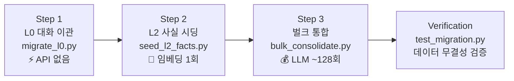

# Phase 6: 데이터 마이그레이션 구현 계획서

> **선행 완료**: xMemory 코어 아키텍처 (Phase 1~5) 구현 및 단위 테스트 통과 완료  
> **목표**: 기존 JSONL 기반 3계층 메모리를 신규 xMemory 4계층 DB로 변환·이관  
> **원칙**: 기존 `MODULE/` 및 `DATABASE/` 원본 파일 **읽기 전용** (수정·삭제 없음)

---

## 기존 데이터 현황 분석

### 마이그레이션 소스 파일

| 파일 | 경로 | 레코드 수 | 형식 | 역할 |
| :--- | :--- | ---: | :--- | :--- |
| **talking_history.jsonl** | [talking_history.jsonl](file:///c:/Users/taewo/Desktop/Programming/Team_Listro/L.A.S/Project/DATABASE/About_LAS/talking_history.jsonl) | 1,274줄 | `{"role","name","content", [situation/support]}` | 원시 대화 전체 기록 |
| **summary_history.jsonl** | [summary_history.jsonl](file:///c:/Users/taewo/Desktop/Programming/Team_Listro/L.A.S/Project/DATABASE/About_LAS/summary_history.jsonl) | 88줄 | `{"timestamp","level","used_method","result(summary)"}` | 기존 중기 요약 |
| **LAS_memory.jsonl** | [LAS_memory.jsonl](file:///c:/Users/taewo/Desktop/Programming/Team_Listro/L.A.S/Project/DATABASE/About_LAS/Memory/LAS_memory.jsonl) | 12줄 | `{"facts": ["...", "..."]}` | L.A.S. 관련 영구 사실 |
| **Listro_memory.jsonl** | [Listro_memory.jsonl](file:///c:/Users/taewo/Desktop/Programming/Team_Listro/L.A.S/Project/DATABASE/About_LAS/Memory/Listro_memory.jsonl) | 4줄 | `{"facts": ["...", "..."]}` | Listro 관련 영구 사실 |
| **reference.jsonl** | [reference.jsonl](file:///c:/Users/taewo/Desktop/Programming/Team_Listro/L.A.S/Project/DATABASE/About_LAS/reference.jsonl) | 20줄 | `{"user","assistant"}` | 예시 대화 쌍 (성격 참조) |

### 마이그레이션 대상 (Target)

| 대상 계층 | 저장소 | 스키마 |
| :--- | :--- | :--- |
| **Level 0** (원시 대화) | SQLite `raw_messages` | `turn_id, timestamp, speaker, name, content` |
| **Level 2** (사실) | ChromaDB `level_2_facts` | `id, text, parent_theme_id, status, ...` + embedding |
| **Level 1** (에피소드) | ChromaDB `level_1_episodes` | `id, summary, parent_theme_id, topics, ...` + embedding |
| **Level 3** (테마) | ChromaDB `level_3_themes` | 이미 `themes.json`에서 초기화됨 (마이그레이션 불필요) |

---

## User Review Required

> [!IMPORTANT]
> **마이그레이션 스크립트는 OpenAI API를 호출합니다.**
> - **Step 2 (사실 시딩)**: 기존 `*_memory.jsonl`의 사실 텍스트를 임베딩하기 위해 `text-embedding-3-small` API 호출 (약 16건 → API 1회)
> - **Step 3 (벌크 통합)**: 1,274턴을 청크(20턴 단위)로 분할하여 LLM에 사실 추출 및 에피소드 생성 요청 (약 64청크 × 2 LLM 호출 = ~128 API 호출)
> 
> **Step 3은 API 비용이 발생하므로**, 일단 Step 1 + Step 2만 먼저 실행하고 Step 3은 별도 승인 후 진행하는 것을 권장합니다.

> [!WARNING]
> **`situation` / `support` 필드 처리 정책**  
> `talking_history.jsonl`의 일부 레코드에는 `situation` (요약 문자열 또는 JSON 객체) 및 `support` (시스템 메시지 배열) 필드가 포함되어 있습니다. 이 필드들은 기존 시스템의 중기·장기 메모리 주입 흔적으로, **xMemory에서는 별도 계층(L1/L2)이 이를 대체하므로 L0 저장 시 `content`만 추출하여 저장**합니다.

---

## Resolved Decisions

> [!NOTE]
> **Q1. Step 3 (벌크 LLM 통합) 실행 범위**: **방안 A** (1,274턴 전체 데이터를 한 번에 마이그레이션)를 채택합니다.
> 
> **Q2. `reference.jsonl` 처리**: **방안 A** (기존 방식 유지)를 채택합니다.
> 
> **Q3. 사용자 프로필 및 L.A.S. 페르소나 처리**: **대안 B** (사용자 프로필용 테마 `T_10` 추가, 페르소나 규칙은 `role_prompt.txt`에 직접 고정)를 채택합니다.
> - L.A.S. 말투/호칭 규칙 등 정적 사실은 [role_prompt.txt](file:///c:/Users/taewo/Desktop/Programming/Team_Listro/L.A.S/Project/LAS_Memory_V2/core/data/prompts/role_prompt.txt)에 고정 반영했습니다.
> - 사용자(Listro) 관련 사실은 `T_10` 테마로 분류하여 ChromaDB에 시딩합니다.
> - [MemoryRetriever.retrieve](file:///c:/Users/taewo/Desktop/Programming/Team_Listro/L.A.S/Project/LAS_Memory_V2/core/retriever/search.py)에서 `T_10`을 상시 로드하고, 결과를 `$USER_MEMORY`와 `$MEMORY` 템플릿에 분리 주입하도록 연동합니다.

---

## Proposed Changes

### 디렉토리 구조 (신규 파일)

```
Project/LAS_Memory_V2/
├── core/                          ← 기존 코어 (변경 없음)
├── tests/                         ← 기존 테스트 (변경 없음)
├── migration/                     ← 🆕 마이그레이션 전용
│   ├── __init__.py
│   ├── migrate_l0.py              ← Step 1: talking_history → SQLite
│   ├── seed_l2_facts.py           ← Step 2: *_memory.jsonl → ChromaDB L2
│   ├── bulk_consolidate.py        ← Step 3: L0 → LLM 가공 → L1/L2
│   └── run_migration.py           ← 통합 실행 스크립트 (CLI)
├── tests/
│   └── test_migration.py          ← 🆕 마이그레이션 검증 테스트
└── docs/
```

---

### Step 1: L0 대화 이관 — `migrate_l0.py`

#### [NEW] [migrate_l0.py](file:///c:/Users/taewo/Desktop/Programming/Team_Listro/L.A.S/Project/LAS_Memory_V2/migration/migrate_l0.py)

**기능**: `talking_history.jsonl` → SQLite `raw_messages` 테이블로 1:1 삽입

```python
class L0Migrator:
    """기존 talking_history.jsonl을 SQLite Level 0으로 이관"""
    
    def __init__(self, source_path: str, sqlite_store: RawMessageStore):
        self.source_path = Path(source_path)
        self.sqlite_store = sqlite_store
    
    def migrate(self, dry_run: bool = False) -> MigrationReport:
        """
        1. source_path에서 JSONL 한 줄씩 읽기
        2. 각 줄의 {"role", "name", "content"} 추출
        3. sqlite_store.insert_turn(speaker, name, content) 호출
        4. situation/support 필드는 무시 (L0은 원시 content만)
        5. 결과 리포트 반환
        """
```

**변환 매핑:**

| 소스 필드 | 대상 컬럼 | 변환 규칙 |
| :--- | :--- | :--- |
| `role` | `speaker` | 그대로 (`"user"` / `"assistant"`) |
| `name` | `name` | 그대로 (`"Listro"`, `"L.A.S."`, `"라미스"` 등) |
| `content` | `content` | 그대로 |
| — | `timestamp` | 같은 줄의 `situation.timestamp`가 있으면 사용, 없으면 `1970-01-01T00:00:00` + line_index로 순서 보장 |
| `situation` | *(무시)* | xMemory L1/L2가 대체 |
| `support` | *(무시)* | 기존 시스템 메시지 (불필요) |

> [!NOTE]
> **타임스탬프 복원**: `talking_history.jsonl` 초기 레코드(~line 22)에는 `situation`이 문자열 또는 없음이고, 이후 레코드부터 `situation.timestamp`가 JSON 객체로 포함됩니다. 타임스탬프가 없는 레코드는 순서 보장을 위해 에포크 기반 더미 타임스탬프를 할당합니다.

**API 호출**: ❌ 없음  
**예상 소요**: 수 초 (1,274건 SQLite 벌크 삽입)

---

### Step 2: L2 사실 시딩 — `seed_l2_facts.py`

#### [NEW] [seed_l2_facts.py](file:///c:/Users/taewo/Desktop/Programming/Team_Listro/L.A.S/Project/LAS_Memory_V2/migration/seed_l2_facts.py)

**기능**: 기존 `*_memory.jsonl`의 사실 데이터를 ChromaDB L2에 시딩

```python
class L2Seeder:
    """기존 memory JSONL의 facts를 ChromaDB Level 2에 시딩"""
    
    def __init__(self, memory_files: list[str], 
                 vector_store: VectorStore,
                 embedding_client: EmbeddingClient,
                 config: XMemoryConfig):
        ...
    
    def seed(self, dry_run: bool = False) -> SeedReport:
        """
        1. LAS_memory.jsonl + Listro_memory.jsonl 파싱
        2. 각 {"facts": [...]} 행에서 사실 문자열 추출 → 플랫 리스트로 병합
        3. 중복 제거 (정규화 후 비교)
        4. 임베딩 생성 (배치 API 1회)
        5. 테마 자동 매핑: 각 사실의 임베딩 → find_themes() → parent_theme_id 결정
        6. vector_store.add_facts() 호출
        """
```

**변환 매핑:**

| 소스 | 대상 (L2 fact) | 변환 규칙 |
| :--- | :--- | :--- |
| `facts[i]` (문자열) | `text` | 그대로 |
| — | `id` | `F_seed_{auto_increment}` |
| — | `parent_theme_id` | `find_themes(embedding)` 결과 중 최상위 테마 |
| — | `status` | `"active"` |
| — | `source_episode_id` | `"SEED_MIGRATION"` (마이그레이션 출처 표시) |
| — | `created_at` | 마이그레이션 실행 시각 |

**기존 사실 데이터 예시:**
```jsonl
# LAS_memory.jsonl
{"facts": ["라스는 리스트로를 부를 때 '주인님'이나 '리스트로님'이라고 부른다..."]}
{"facts": ["LAS는 딱딱한 말투를 기본으로 하며 유머도 사용할 수 있다."]}

# Listro_memory.jsonl
{"facts": ["리스트로는 라스를 개발하는 취미를 가지고 있다."]}
```

**API 호출**: 임베딩 API 1회 (배치, ~16건)  
**예상 소요**: 1~2초

---

### Step 3: 벌크 통합 — `bulk_consolidate.py`

#### [NEW] [bulk_consolidate.py](file:///c:/Users/taewo/Desktop/Programming/Team_Listro/L.A.S/Project/LAS_Memory_V2/migration/bulk_consolidate.py)

**기능**: Step 1에서 이관된 L0 데이터를 청크 단위로 LLM 가공하여 L1 에피소드 + L2 사실 생성

```python
class BulkConsolidator:
    """L0 원시 대화를 청크 단위로 LLM 가공 → L1/L2 생성"""
    
    def __init__(self, sqlite_store, vector_store, 
                 embedding_client, openai_client, config):
        self.extractor = FactExtractor(openai_client, ...)
        self.context_builder = ContextBuilder(openai_client, ...)
        ...
    
    def consolidate_all(self, chunk_size: int = 20, 
                         overlap: int = 2,
                         dry_run: bool = False) -> ConsolidationReport:
        """
        1. SQLite에서 전체 turn_id 범위 확인
        2. chunk_size(20) + overlap(2) 단위로 슬라이딩 윈도우 분할
        3. 각 청크에 대해:
           a. extractor.extract(chunk) → facts[]
           b. context_builder.build(chunk, facts) → episode{}
           c. 임베딩 생성 (facts + episode)
           d. 테마 매핑 (find_themes)
           e. 충돌 검사 (find_conflicting_facts)
           f. vector_store.add_facts() + add_episode()
           g. WAL 등록 + 완료 처리 (이력 추적용)
        4. 진행률 로깅 (청크 N/M 처리 중...)
        5. 결과 리포트 반환
        """
    
    def consolidate_range(self, start_turn: int, end_turn: int, 
                           dry_run: bool = False):
        """특정 범위만 선택적 통합 (부분 마이그레이션용)"""
```

**청크 분할 예시 (1,274턴, chunk=20, overlap=2):**
```
Chunk  1: turn_id   1 ~  20  → Episode E_1,  Facts F_1 ~ F_n
Chunk  2: turn_id  19 ~  38  → Episode E_19, Facts ...
Chunk  3: turn_id  37 ~  56  → Episode E_37, Facts ...
...
Chunk 64: turn_id 1255 ~ 1274 → Episode E_1255, Facts ...
```

**API 호출**: ~128회 LLM + ~64회 임베딩 (배치)  
**예상 소요**: 5~10분 (rate limiting 고려)

---

### 통합 실행 스크립트 — `run_migration.py`

#### [NEW] [run_migration.py](file:///c:/Users/taewo/Desktop/Programming/Team_Listro/L.A.S/Project/LAS_Memory_V2/migration/run_migration.py)

```python
"""
사용법:
  # Step 1만 실행 (API 호출 없음, 안전)
  python -m migration.run_migration --step 1

  # Step 1 + 2 실행 (임베딩 API만)
  python -m migration.run_migration --step 1 2

  # 전체 실행 (LLM API 포함, 비용 발생)
  python -m migration.run_migration --step 1 2 3

  # Dry Run (실제 DB 쓰기 없이 시뮬레이션)
  python -m migration.run_migration --step 1 2 3 --dry-run
  
  # Step 3 부분 실행 (최근 200턴만)
  python -m migration.run_migration --step 3 --range 1074 1274
"""

import argparse

def main():
    parser = argparse.ArgumentParser(description="xMemory 데이터 마이그레이션")
    parser.add_argument("--step", nargs="+", type=int, required=True,
                        help="실행할 스텝 (1, 2, 3)")
    parser.add_argument("--dry-run", action="store_true",
                        help="실제 DB 쓰기 없이 시뮬레이션")
    parser.add_argument("--range", nargs=2, type=int, default=None,
                        help="Step 3 부분 실행 범위 (start end)")
    ...
```

---

### 마이그레이션 검증 테스트 — `test_migration.py`

#### [NEW] [test_migration.py](file:///c:/Users/taewo/Desktop/Programming/Team_Listro/L.A.S/Project/LAS_Memory_V2/tests/test_migration.py)

| 테스트 케이스 | 검증 내용 |
| :--- | :--- |
| `test_l0_migration_count` | 마이그레이션 후 SQLite `raw_messages` 행 수 = 소스 JSONL 줄 수 |
| `test_l0_content_integrity` | 무작위 샘플 10건의 `content` 필드가 소스와 일치 |
| `test_l0_timestamp_ordering` | `turn_id` 순서 = 원본 JSONL 줄 순서 |
| `test_l2_seed_facts_count` | ChromaDB L2의 시드 팩트 수 ≥ 소스 팩트 수 (중복 제거 후) |
| `test_l2_seed_facts_searchable` | 시드된 사실이 유사도 검색으로 조회 가능한지 확인 |
| `test_situation_fields_excluded` | L0 레코드에 `situation`/`support` 데이터가 포함되지 않았는지 확인 |

---

### core 모듈 보완 — `search.py` 및 `manager.py`

#### [MODIFY] [search.py](file:///c:/Users/taewo/Desktop/Programming/Team_Listro/L.A.S/Project/LAS_Memory_V2/core/retriever/search.py)

**기능**: `T_10` (사용자 프로필) 테마 상시 로드 및 메모리 분할 반환
- `retrieve()` 실행 시, 검출된 테마 목록에 `"T_10"`을 항상 강제로 포함시킵니다.
- 검색 결과 사실 중 `parent_theme_id == "T_10"`인 항목들은 `user_facts`로, 그 외는 `facts`로 분리하여 반환합니다.
- 반환 형식: `{"facts": [...], "user_facts": [...], "episodes": [...]}`

#### [MODIFY] [manager.py](file:///c:/Users/taewo/Desktop/Programming/Team_Listro/L.A.S/Project/LAS_Memory_V2/core/manager.py)

**기능**: 시스템 프롬프트 템플릿 치환 시 `$USER_MEMORY` 지원
- `talking_LAS()`에서 RAG로 조회된 `user_facts`를 `$USER_MEMORY` 영역에 바인딩합니다.
- `facts`와 `episodes`는 기존대로 `$MEMORY` 영역에 바인딩합니다.

---

## 구현 순서



| Step | 산출물 | API 비용 | 실행 조건 |
| :---: | :--- | :---: | :--- |
| **1** | SQLite `raw_messages` 1,274건 | 없음 | 즉시 실행 가능 |
| **2** | ChromaDB `level_2_facts` ~16건 (시드) | 최소 | OPENAI_API_KEY 필요 |
| **3** | ChromaDB `level_1_episodes` + `level_2_facts` (다량) | 중간 | 사용자 명시 승인 후 |

---

## Verification Plan

### Automated Tests

```bash
# Step 1 + 2 이후 검증
.venv\Scripts\pytest Project/LAS_Memory_V2/tests/test_migration.py -v

# 기존 테스트 회귀 확인
.venv\Scripts\pytest Project/LAS_Memory_V2/tests/ -v
```

### Manual Verification

1. **원본 데이터 무손상**: `DATABASE/` 디렉토리의 JSONL 파일들이 변경되지 않았는지 `git status` 확인
2. **L0 데이터 무결성**: SQLite에서 첫 번째/마지막 턴의 `content`가 소스와 일치하는지 수동 비교
3. **L2 시드 팩트 검색**: ChromaDB에서 "리스트로는 라스를 개발하는 취미" 등의 사실이 유사도 검색으로 반환되는지 확인
4. **MODULE/ 무영향**: `MODULE/` 디렉토리에 변경 사항이 없는지 `git diff PROJECT/MODULE/` 확인
