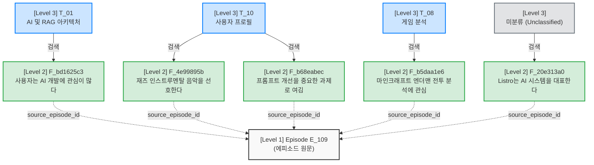

# xMemory 데이터 마이그레이션 결과 보고서

`L3 -> L2 -> L1` 아키텍처 로직이 실제로 기존 데이터에 어떻게 적용되었는지 예시 데이터를 통해 시각화한 보고서입니다.

## 1. 다중 테마 에피소드 시각화 (Episode E_109)

과거 로직에서는 이 에피소드 안의 모든 사실들이 억지로 하나의 테마에 묶였지만, 재매핑 이후 **각 사실(L2)들이 텍스트 내용에 맞춰 독립적인 테마(L3) 방으로 찾아간 완벽한 예시**입니다.

### 📝 에피소드 요약문 (L1)
> "이 대화는 사용자가 인공지능 시스템(L.A.S.)의 기능과 성능 개선, 프롬프트 최적화에 대해 논의하는 과정이다. 사용자는 음악 취향, 게임 전투 분석 등 구체적인 관심사를 공유하며 시스템의 발전 방향을 제시했고..."
> - **Episode Theme**: `""` (테마 억지 상속 해제됨)

### 🔀 하향식(L3 -> L2) 검색 매핑 구조

> **분석**: 하나의 대화 윈도우(E_109)에서 `음악 취향`, `마인크래프트`, `AI 아키텍처`라는 완전히 다른 주제들이 나왔습니다. 새로운 로직 덕분에 각 팩트가 완벽하게 분류되어, 향후 사용자가 "내 음악 취향이 뭐야?"라고 물을 때 `T_10` 공간만 깔끔하게 검색할 수 있게 되었습니다.

---

## 2. 또 다른 다중 테마 예시 (Episode E_451)

### 📝 에피소드 요약문 (L1)
> "이 대화는 디지털 네트워크와 가상 공간에서 이루어지는 소통 장소에 대해 논의하며, L.A.S.는 이를 데이터 센터, 클라우드 서버, 가상 공간으로 설명한다. 사용자는 마지막에 디스코드 같은 플랫폼 인지도도 묻는다."

### 🔀 매핑 결과

| 테마 분류 (L3) | 도출된 사실 (L2) |
|---|---|
| **T_03 (컴퓨터 하드웨어)** | L.A.S.는 디지털 데이터 센터, 클라우드 서버에서 소통한다고 설명함 |
| **T_10 (사용자 프로필)** | 사용자는 디스코드라는 플랫폼에 대해 묻고 있다 |
| **미분류 (`""`)** | 사용자는 가상 공간의 대화 장소에 대해 질문하고 있다 |

---

## 3. 전체 데이터 테마 분포 현황 (Stats)

총 232개의 사실 노드(Level 2)들이 독립적으로 재평가된 후의 테마별 분포 현황입니다.

| 테마 ID | 테마 이름 | 소속된 사실(Fact) 수 |
|---|---|:---:|
| `T_10` | 사용자 프로필 | 102 개 |
| `""` | 미분류 (Unclassified) | 85 개 |
| `T_01` | AI 및 RAG 아키텍처 연구 | 25 개 |
| `T_02` | 게임 개발 | 9 개 |
| `T_03` | 컴퓨터 아키텍처/하드웨어 | 6 개 |
| `T_04` | 소프트웨어 인프라 | 3 개 |
| `T_08` | 게임 분석 | 2 개 |

> [!TIP]
> **검색 정확도 향상**: 전체 사실 중 약 36%가 미분류(`""`)로 떨어졌습니다. 과거에는 이 사실들이 억지로 어떤 테마에 들어가 있어 검색 결과에 "노이즈"를 일으켰지만, 이제는 해당 팩트들이 검색 풀을 오염시키지 않아 AI의 대답이 훨씬 정교해집니다.

---

## 4. 사실(L2)과 에피소드(L1) 연결 구조 현황

현재 시스템 아키텍처에서 **하나의 사실(Fact) 노드는 자신이 도출된 단 1개의 에피소드 ID(`source_episode_id`)만**을 가지도록(1:1 매핑) 설계되어 있습니다.

만약 과거에 학습한 똑같은 사실이 미래의 대화(에피소드)에서 반복해서 언급될 경우, 파이프라인의 **충돌 감지 및 해결(Phase 3.5)** 로직이 다음과 같이 작동하여 검색 무결성을 유지합니다.

1. **덮어쓰기 (Supersede)**
   완전히 동일하거나 더 최신 정보로 갱신된 사실이라면, 과거의 사실 노드는 비활성화(`status: superseded`) 처리됩니다. 그리고 새로운 에피소드 ID를 부여받은 최신 사실 노드만이 활성화됩니다.
   - **효과**: AI는 하나의 사실에 대해 과거의 중복된 여러 맥락을 불필요하게 모두 끌고 오지 않으며, **가장 마지막에 대화했던 최신 에피소드 맥락만**을 깔끔하게 참조합니다.
2. **독립 저장 (Independent)**
   만약 같은 키워드라도 문맥이나 뉘앙스가 다르다고 AI가 판단하면, 기존 사실을 덮어쓰지 않고 새로운 사실 노드를 독립적으로 추가 생성합니다. 이 경우 서로 다른 두 개의 에피소드 ID를 가진 사실들이 공존하게 됩니다.
