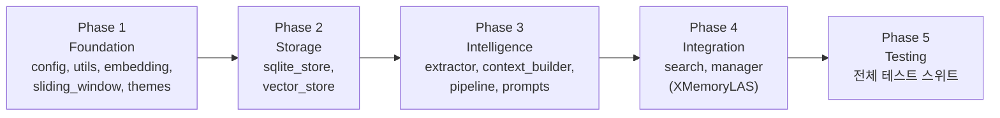

# L.A.S. xMemory 4-Layer Architecture — 구현 계획서 v2

> **기준 문서**: [LAS_xMemory_Architecture_v2.md](file:///c:/Users/taewo/Desktop/Programming/Team_Listro/L.A.S/Project/LAS_Memory_V2/docs/LAS_xMemory_Architecture_v2.md), [LAS_xMemory_TechStack.md](file:///c:/Users/taewo/Desktop/Programming/Team_Listro/L.A.S/Project/LAS_Memory_V2/docs/LAS_xMemory_TechStack.md)  
> **대상 경로**: `Project/LAS_Memory_V2/core/`  
> **원칙**: 기존 `MODULE/` 코드 무수정, 포크/교체 방식 + MODULE 비의존

---

## 확정된 설계 결정 사항

| # | 결정 | 내용 |
|---|---|---|
| **Q1** | 프롬프트 + 데이터 배치 | `core/data/prompts/` (git 추적) + `core/data/store/` (gitignore) — **변형 B** |
| **Q2** | 기존 데이터 마이그레이션 | 아키텍처 구현 후 별도 Phase로 진행 |
| **Q3** | 통합 전략 | **포크/교체 방식** — 기존 `LAS_SYSTEM` 구조를 계승하되, `MODULE`을 import하지 않고 필요한 유틸리티만 `core/`로 복사 |

---

## User Review Required

> [!IMPORTANT]
> 아래 항목들은 코딩 착수 전 사용자의 명시적 승인이 필요한 구조적 결정 사항입니다.

1. **SQLite 스키마 확정** — `raw_messages` + `consolidation_wal` 테이블 설계 (Section 3.1 참조)
2. **ChromaDB 메타데이터 바인딩 규칙** — L1/L2/L3 각 컬렉션의 메타데이터 필드 및 타입 (Section 3.2 참조)
3. **ID 채번 전략** — 에피소드 `E_{start_turn_id}`, 사실 `F_{auto_increment}`
4. **기존 코드 복사 범위** — `MODULE/`에서 `core/`로 복사할 유틸리티 목록 (Section 2 참조)

---

## Proposed Changes

### 1. 디렉토리 구조

```
Project/LAS_Memory_V2/
├── core/                              ← 모든 신규 코드
│   ├── __init__.py                    ← 패키지 초기화 + 공개 API
│   ├── config.py                      ← 경로/상수/환경변수 관리
│   ├── data/                          ← 데이터 + 프롬프트 통합 루트
│   │   ├── prompts/                   ← 🔵 git 추적 (코드 자산)
│   │   │   ├── fact_extract_prompt.txt
│   │   │   ├── context_generate_prompt.txt
│   │   │   └── conflict_check_prompt.txt
│   │   ├── store/                     ← 🔴 .gitignore (런타임 생성물)
│   │   │   ├── raw_messages.db        ← SQLite (Level 0 + WAL)
│   │   │   └── vector_store/          ← ChromaDB PersistentClient
│   │   └── themes.json               ← 🔵 git 추적 (L3 정적 설정)
│   ├── database/                      ← 저장소 계층
│   │   ├── __init__.py
│   │   ├── sqlite_store.py            ← Level 0 (raw_messages + WAL)
│   │   └── vector_store.py            ← Level 1, 2, 3 (ChromaDB)
│   ├── consolidator/                  ← 비동기 기억 통합
│   │   ├── __init__.py
│   │   ├── pipeline.py                ← 4-Phase 통합 파이프라인 오케스트레이터
│   │   ├── extractor.py               ← Pass 1: L2 사실 추출 (LLM)
│   │   └── context_builder.py         ← Pass 2: L1 맥락 생성 (LLM)
│   ├── retriever/                     ← 응답 생성 시 검색
│   │   ├── __init__.py
│   │   └── search.py                  ← Phase 0~4 검색 파이프라인
│   ├── utils/                         ← MODULE에서 복사한 유틸리티 + 확장
│   │   ├── __init__.py
│   │   ├── openai_client.py           ← OpenAIClient 복사 + Tool Calling 확장
│   │   ├── json_utils.py              ← extract_json_from_llm_response 복사
│   │   └── log_utils.py               ← log_set, log_jsonl 패턴 복사
│   ├── sliding_window.py              ← 단기 기억 슬라이딩 윈도우
│   ├── embedding.py                   ← OpenAI 임베딩 래퍼
│   └── manager.py                     ← XMemoryLAS (포크된 통합 관리자)
├── tests/                             ← 단위 테스트
│   ├── __init__.py
│   ├── test_sqlite_store.py
│   ├── test_vector_store.py
│   ├── test_sliding_window.py
│   ├── test_consolidator.py
│   ├── test_retriever.py
│   └── test_manager.py
└── docs/                              ← 기존 분석 문서 (변경 없음)
```

**`.gitignore` 추가 규칙:**
```gitignore
# xMemory 런타임 데이터 (store 폴더 전체)
Project/LAS_Memory_V2/core/data/store/
```

---

### 2. MODULE → core 복사 범위 (포크/교체 전략)

기존 `MODULE/`의 코드를 **import하지 않고**, 필요한 부분만 `core/utils/`로 복사하여 독립성을 확보합니다.

| 원본 파일 | 복사 대상 | 복사할 요소 | 변경/확장 사항 |
|---|---|---|---|
| [OPENAI_ai.py](file:///c:/Users/taewo/Desktop/Programming/Team_Listro/L.A.S/Project/MODULE/OPENAI_ai.py) | `core/utils/openai_client.py` | `OpenAIClient` 클래스 전체 | + `call_AI_with_tools()` 메서드 추가 (Tool Calling), + `get_embedding()` 메서드 추가 |
| [LAS.py](file:///c:/Users/taewo/Desktop/Programming/Team_Listro/L.A.S/Project/MODULE/LAS.py) L38-74 | `core/utils/json_utils.py` | `extract_json_from_llm_response()` 함수 | 변경 없음 (그대로 복사) |
| [log.py](file:///c:/Users/taewo/Desktop/Programming/Team_Listro/L.A.S/Project/MODULE/log.py) | `core/utils/log_utils.py` | `log_set` 클래스 | 경로만 xMemory용으로 조정 |
| [log_json.py](file:///c:/Users/taewo/Desktop/Programming/Team_Listro/L.A.S/Project/MODULE/log_json.py) | `core/utils/log_utils.py` | `log_jsonl` 클래스 | `threading.Lock()` 추가 (동시성 안전) |
| [LAS.py](file:///c:/Users/taewo/Desktop/Programming/Team_Listro/L.A.S/Project/MODULE/LAS.py) L76-262 | `core/manager.py` | `LAS_SYSTEM` 클래스 구조 (골격) | 아래 상세 기술 |

#### `core/manager.py` — `XMemoryLAS` 클래스 설계 (포크 상세)

기존 `LAS_SYSTEM`의 골격을 계승하되, 내부 메서드를 교체합니다:

```python
class XMemoryLAS:
    """
    기존 LAS_SYSTEM 구조를 계승한 xMemory 기반 대화 시스템.
    MODULE/LAS.py의 LAS_SYSTEM을 포크하여 메모리/판단 부분을 교체.
    MODULE을 import하지 않으며, 필요한 유틸은 core/utils/에서 참조.
    """
    
    def __init__(self, config: XMemoryConfig = None):
        # ── 기존 LAS_SYSTEM에서 유지하는 부분 ──
        self.AI = OpenAIClient()           # core/utils/openai_client.py (복사본)
        self.role_prompt = ...             # 기존 role_prompt.txt 로드
        self.judge_prompt = ...            # 기존 judge_prompt.txt 로드
        self.reference = ...               # 기존 reference.jsonl 로드
        self.place = "Listro의 개발실"
        self.scenario = "..."
        
        # ── 신규 xMemory 컴포넌트 (교체 부분) ──
        self.window = SlidingWindow(20)              # get_history() 대체
        self.sqlite_store = RawMessageStore(...)      # L0 저장소
        self.vector_store = VectorStore(...)           # L1/L2/L3 저장소
        self.embedding = EmbeddingClient(...)          # 임베딩
        self.consolidator = ConsolidationPipeline(...) # make_memory()+summary() 대체
        self.retriever = MemoryRetriever(...)          # 기억 검색
    
    # ── 유지 (소폭 확장) ──
    def record(self, data): ...            # 기존 로직 유지
    
    def judge(self, content, need_rag_check=True):
        """기존 judge() 확장: RAG 필요 여부 판별 추가"""
        # 기존: "[일반_대화]" | "[음악_재생]" | "[판단_불가]"
        # 확장: "[일반_대화:RAG]" | "[일반_대화:NO_RAG]" 등
    
    def talking_LAS(self, *, name, content, memory_context, ...):
        """기존 talking_LAS() 확장: Tool Calling + 목차 주입 패턴"""
        # 기존: System Prompt 조립 → call_AI()
        # 확장: $MEMORY에 L2 사실 + L1 목차 주입
        #       call_AI_with_tools() 사용
        #       tool_call 결과 시 Phase 4 진입
    
    # ── 폐기 ──
    # def summary(self, ...):     → 폐기 (슬라이딩 윈도우 + 비동기 통합으로 대체)
    # def make_memory(self, ...): → 폐기 (ConsolidationPipeline으로 대체)
    # def get_history(self, ...): → 폐기 (SlidingWindow.get_messages()로 대체)
    
    # ── 교체된 메인 파이프라인 ──
    def process(self, content: str, talker: str) -> str:
        """
        기존 process() 골격을 유지하되 내부 호출 교체.
        
        기존 흐름 (5 API):
          make_memory → judge → talking_LAS → summary → make_memory
        
        신규 흐름 (2~4 API):
          1. window.push(user_turn) → evict 시 consolidator.trigger()
          2. judge(content) → RAG 필요 여부 판별
          3. if RAG: retriever.retrieve() → L2 사실 + L1 목차
          4. talking_LAS(memory_context=...) → 1차 생성
          5. if tool_call: deep_search → 2차 생성
          6. window.push(assistant_turn) → evict 시 trigger()
          7. return result
        """
```

**기존 → 신규 메서드 매핑:**

| 기존 메서드 | 처리 | 신규 대응 |
|---|---|---|
| `__init__()` | **유지 + 확장** | 기존 프롬프트/참조 로딩 유지, xMemory 컴포넌트 추가 |
| `record()` | **그대로 유지** | 로깅 로직 동일 |
| `@input_record` | **유지** | 대화 기록 데코레이터 (L0 SQLite로 기록 대상 변경) |
| `judge()` | **확장** | RAG 필요 여부 판별 분기 추가 |
| `talking_LAS()` | **확장** | Tool Calling 지원, 메모리 주입 형식 변경 |
| `get_history()` | **폐기 → 교체** | `SlidingWindow.get_messages()` |
| `make_memory()` | **폐기 → 교체** | `ConsolidationPipeline` (비동기) |
| `summary()` | **폐기** | 윈도우 확대(20턴)로 중기 계층 불필요 |
| `process()` | **골격 유지, 내부 교체** | 위 상세 참조 |

---

### 3. Database Layer (`core/database/`)

#### 3.1 [NEW] [sqlite_store.py](file:///c:/Users/taewo/Desktop/Programming/Team_Listro/L.A.S/Project/LAS_Memory_V2/core/database/sqlite_store.py)

**Level 0 원시 대화 저장소 + WAL 관리**

```python
class RawMessageStore:
    def __init__(self, db_path: str):
        """SQLite 연결, WAL 모드, 테이블 생성"""
    
    def insert_turn(self, speaker: str, name: str, content: str) -> int:
        """단일 턴 삽입, turn_id 반환"""
    
    def get_turns_by_range(self, start_id: int, end_id: int) -> list[dict]:
        """turn_id 범위로 원시 대화 O(1) 로드 (Phase 4용)"""
    
    def enqueue_wal(self, start_turn: int, end_turn: int) -> int:
        """WAL에 통합 대상 구간 등록"""
    
    def dequeue_wal(self) -> dict | None:
        """pending 상태의 가장 오래된 WAL 항목 반환"""
    
    def complete_wal(self, wal_id: int):
        """WAL 항목 status를 'done'으로 전이"""
```

**SQLite 스키마:**

```sql
-- Level 0: 원시 대화 불변 렛저
CREATE TABLE IF NOT EXISTS raw_messages (
    turn_id    INTEGER PRIMARY KEY AUTOINCREMENT,
    timestamp  TEXT    NOT NULL,  -- ISO 8601
    speaker    TEXT    NOT NULL,  -- 'user' | 'assistant'
    name       TEXT    NOT NULL,  -- 'Listro' | 'L.A.S.' 등
    content    TEXT    NOT NULL
);

-- WAL: 비동기 통합 파이프라인 작업 큐
CREATE TABLE IF NOT EXISTS consolidation_wal (
    id           INTEGER PRIMARY KEY AUTOINCREMENT,
    start_turn   INTEGER NOT NULL,
    end_turn     INTEGER NOT NULL,
    status       TEXT    DEFAULT 'pending',  -- 'pending' | 'processing' | 'done' | 'failed'
    created_at   TEXT    NOT NULL,
    completed_at TEXT
);

CREATE INDEX IF NOT EXISTS idx_wal_status ON consolidation_wal(status);
```

---

#### 3.2 [NEW] [vector_store.py](file:///c:/Users/taewo/Desktop/Programming/Team_Listro/L.A.S/Project/LAS_Memory_V2/core/database/vector_store.py)

**Level 1/2/3 벡터 저장소 (ChromaDB)**

```python
class VectorStore:
    def __init__(self, persist_dir: str):
        """ChromaDB PersistentClient 초기화, 3개 컬렉션 생성"""
    
    # --- Level 3 (테마) ---
    def init_themes(self, themes: list[dict]):
        """하드코딩된 테마를 벡터 공간에 고정 (upsert)"""
    
    def find_themes(self, query_embedding: list[float], threshold: float) -> list[str]:
        """질의 벡터와 코사인 유사도가 임계치 초과인 테마 ID 반환"""
    
    # --- Level 2 (사실) ---
    def add_facts(self, facts: list[dict], embeddings: list[list[float]]):
        """사실 노드 배치 삽입"""
    
    def search_facts(self, query_embedding: list[float], 
                     theme_ids: list[str], top_k: int) -> list[dict]:
        """Phase 2 주검색: 테마 필터 + Top-K 유사도 검색"""
    
    def find_conflicting_facts(self, embedding: list[float], threshold: float) -> list[dict]:
        """Phase 3.5: 유사 사실 충돌 후보군 검색"""
    
    def supersede_fact(self, old_id: str, new_id: str):
        """사실 상태 전이: old → superseded, new → active"""
    
    # --- Level 1 (에피소드) ---
    def add_episode(self, episode: dict, embedding: list[float]):
        """에피소드 맥락 노드 삽입"""
    
    def get_episodes_by_ids(self, episode_ids: list[str]) -> list[dict]:
        """ID 목록으로 에피소드 메타데이터 일괄 조회"""
```

**ChromaDB 메타데이터 바인딩 규칙:**

| 컬렉션 | ID 형식 | 메타데이터 필드 | 타입 |
|---|---|---|---|
| `level_3_themes` | `T_01` ~ `T_09` | `theme_name`, `description` | `str` |
| `level_2_facts` | `F_{auto_increment}` | `status`, `parent_theme_id`, `source_episode_id`, `source_range_start`, `source_range_end`, `created_at`, `superseded_by` | `str`, `str`, `str`, `int`, `int`, `str`, `str\|None` |
| `level_1_episodes` | `E_{start_turn_id}` | `parent_theme_id`, `target_range_start`, `target_range_end`, `topics` (JSON str), `tech_stack` (JSON str), `conclusion`, `extracted_facts` (JSON str), `created_at` | mixed |

> [!WARNING]
> ChromaDB 메타데이터는 `str`, `int`, `float`, `bool`만 지원합니다. 배열 타입은 **JSON 문자열로 직렬화**, `source_range`는 `start/end` 두 필드로 분리합니다.

---

### 4. Core Utilities

#### [NEW] [config.py](file:///c:/Users/taewo/Desktop/Programming/Team_Listro/L.A.S/Project/LAS_Memory_V2/core/config.py)

```python
@dataclass
class XMemoryConfig:
    # 저장소 경로 (core/data/ 기준)
    data_dir: str = ""           # core/data/
    prompts_dir: str = ""        # core/data/prompts/
    store_dir: str = ""          # core/data/store/
    sqlite_path: str = ""        # core/data/store/raw_messages.db
    vector_store_dir: str = ""   # core/data/store/vector_store/
    themes_path: str = ""        # core/data/themes.json
    
    # 기존 프롬프트 경로 (role_prompt, judge_prompt 등은 기존 위치 참조)
    role_prompt_path: str = ""
    judge_prompt_path: str = ""
    reference_path: str = ""
    
    # 슬라이딩 윈도우
    window_size: int = 20
    overlap_size: int = 2
    
    # 검색 하이퍼파라미터
    theme_threshold: float = 0.3
    fact_top_k: int = 10
    conflict_threshold: float = 0.85
    
    # 모델
    embedding_model: str = "text-embedding-3-small"
    extraction_model: str = "gpt-4.1-nano"
    main_model: str = "gpt-4.1-mini"
    judge_model: str = "gpt-4o-mini"
    
    # 비동기
    consolidation_workers: int = 2
```

---

#### [NEW] [embedding.py](file:///c:/Users/taewo/Desktop/Programming/Team_Listro/L.A.S/Project/LAS_Memory_V2/core/embedding.py)

```python
class EmbeddingClient:
    def __init__(self, api_key: str = None, model: str = "text-embedding-3-small"):
        """OpenAI 클라이언트 독립 초기화"""
    
    def embed_text(self, text: str) -> list[float]:
        """단일 텍스트 → 벡터"""
    
    def embed_batch(self, texts: list[str]) -> list[list[float]]:
        """배치 임베딩 (API 1회 호출로 다수 텍스트 처리)"""
```

---

#### [NEW] [sliding_window.py](file:///c:/Users/taewo/Desktop/Programming/Team_Listro/L.A.S/Project/LAS_Memory_V2/core/sliding_window.py)

```python
class SlidingWindow:
    def __init__(self, max_size: int = 20, overlap: int = 2):
        self._queue: deque = deque(maxlen=max_size)
        self._overlap = overlap
    
    def push(self, turn: dict) -> list[dict] | None:
        """턴 추가. 큐 오버플로우 시 밀려난 턴들 반환"""
    
    def get_messages(self) -> list[dict]:
        """현재 윈도우 → OpenAI messages 형태"""
    
    def get_overlap(self) -> list[dict]:
        """오버랩 구간 (현재 큐의 앞쪽 2턴) 반환"""
```

---

### 5. Utilities (`core/utils/`) — MODULE 복사본

#### [NEW] [openai_client.py](file:///c:/Users/taewo/Desktop/Programming/Team_Listro/L.A.S/Project/LAS_Memory_V2/core/utils/openai_client.py)

[OPENAI_ai.py](file:///c:/Users/taewo/Desktop/Programming/Team_Listro/L.A.S/Project/MODULE/OPENAI_ai.py)의 `OpenAIClient`를 복사 후 확장:

```python
class OpenAIClient:
    # ── 기존 복사 ──
    def call_AI(self, user_request, place=None, *, ...):
        """기존 call_AI 그대로 복사"""
    
    # ── 신규 확장 ──
    def call_AI_with_tools(self, messages: list, tools: list = None,
                            model_set: str = "gpt-4.1-mini") -> dict:
        """Tool Calling 지원. Phase 3-4 전환용.
        Returns: {"type": "text"|"tool_call", ...}"""
    
    def get_embedding(self, text: str, model: str = "text-embedding-3-small") -> list[float]:
        """텍스트 → 벡터 (EmbeddingClient가 이를 래핑)"""
```

#### [NEW] [json_utils.py](file:///c:/Users/taewo/Desktop/Programming/Team_Listro/L.A.S/Project/LAS_Memory_V2/core/utils/json_utils.py)

[LAS.py L38-74](file:///c:/Users/taewo/Desktop/Programming/Team_Listro/L.A.S/Project/MODULE/LAS.py#L38-L74)의 `extract_json_from_llm_response()` 그대로 복사.

#### [NEW] [log_utils.py](file:///c:/Users/taewo/Desktop/Programming/Team_Listro/L.A.S/Project/LAS_Memory_V2/core/utils/log_utils.py)

[log.py](file:///c:/Users/taewo/Desktop/Programming/Team_Listro/L.A.S/Project/MODULE/log.py) + [log_json.py](file:///c:/Users/taewo/Desktop/Programming/Team_Listro/L.A.S/Project/MODULE/log_json.py) 복사 후:
- 로그 경로를 xMemory용으로 조정
- `log_jsonl.append_to_jsonl()`에 `threading.Lock()` 추가 (기존 동시성 문제 해결)

---

### 6. Consolidator (`core/consolidator/`)

#### [NEW] [extractor.py](file:///c:/Users/taewo/Desktop/Programming/Team_Listro/L.A.S/Project/LAS_Memory_V2/core/consolidator/extractor.py)

```python
class FactExtractor:
    """Pass 1: 대화 청크에서 Level 2 사실 추출"""
    def __init__(self, openai_client: OpenAIClient, prompt_path: str): ...
    def extract(self, conversation_chunk: list[dict]) -> list[dict]:
        """→ [{"text": "...", "id": "F_xxx"}, ...]"""
```

#### [NEW] [context_builder.py](file:///c:/Users/taewo/Desktop/Programming/Team_Listro/L.A.S/Project/LAS_Memory_V2/core/consolidator/context_builder.py)

```python
class ContextBuilder:
    """Pass 2: L1 에피소드 맥락 생성"""
    def __init__(self, openai_client: OpenAIClient, prompt_path: str): ...
    def build(self, chunk: list[dict], facts: list[dict]) -> dict:
        """→ {"id": "E_xxx", "summary": ..., "topics": [...], ...}"""
```

#### [NEW] [pipeline.py](file:///c:/Users/taewo/Desktop/Programming/Team_Listro/L.A.S/Project/LAS_Memory_V2/core/consolidator/pipeline.py)

```python
class ConsolidationPipeline:
    """4-Phase 비동기 통합 파이프라인"""
    def __init__(self, config, sqlite_store, vector_store, 
                 embedding_client, openai_client):
        self._executor = ThreadPoolExecutor(max_workers=config.consolidation_workers)
        self._lock = threading.Lock()
    
    def trigger(self, evicted_turns: list[dict], overlap_turns: list[dict]):
        """비동기 실행 트리거: L0 기록 → WAL 등록 → 백그라운드 파이프라인"""
    
    def _run_pipeline(self, wal_entry: dict):
        """
        Phase 2: Pass 1 (사실 추출) → Pass 2 (맥락 생성)
        Phase 3: 임베딩 + 포인터 결합
        Phase 3.5: 충돌 감지 + 상태 전이
        Phase 4: 테마 매핑 + DB 커밋 + WAL 완료
        """
    
    def _detect_and_resolve_conflicts(self, new_facts: list[dict]):
        """Phase 3.5: 유사도 검색 → LLM 논리 모순 평가 → 상태 전이"""
```

---

### 7. Retriever (`core/retriever/`)

#### [NEW] [search.py](file:///c:/Users/taewo/Desktop/Programming/Team_Listro/L.A.S/Project/LAS_Memory_V2/core/retriever/search.py)

```python
class MemoryRetriever:
    def __init__(self, config, vector_store, sqlite_store, embedding_client): ...
    
    def retrieve(self, query: str, need_rag: bool) -> dict:
        """
        Phase 1: 전역 검색 (L3 테마 필터링)
        Phase 2: 국소 검색 (L2 Top-K + L1 연관 에피소드)
        Returns: {"facts": [...], "episodes": [...]}
        """
    
    def deep_search(self, episode_id: str) -> str:
        """Phase 4: 에피소드 → target_range → SQLite L0 로드"""
```

---

### 8. Prompts (`core/data/prompts/`)

#### [NEW] fact_extract_prompt.txt

기존 [memory_prompt.txt](file:///c:/Users/taewo/Desktop/Programming/Team_Listro/L.A.S/Project/DATABASE/About_LAS/prompt/memory_prompt.txt)의 `<thinking>` + JSON 패턴 계승:
- 엄격한 필터링: 숫자, 설정값, 도메인 지식, 고유명사 등 영구적 명제만
- 출력: `{"facts": ["...", "..."]}`
- DON'Ts: 일시적 감정, 단순 인사, 모호한 발언

#### [NEW] context_generate_prompt.txt

- 입력: 원본 대화 + Pass 1 facts
- 출력: `{"summary": "...", "topics": [...], "tech_stack": [...], "conclusion": "..."}`

#### [NEW] conflict_check_prompt.txt

- 입력: 기존 사실 + 신규 사실 + 타임스탬프
- 출력: `{"verdict": "independent" | "supersede", "reason": "..."}`

---

### 9. Themes (`core/data/themes.json`)

```json
[
    {"id": "T_01", "name": "AI 및 RAG 아키텍처 연구", "description": "AI 모델, 임베딩, 검색 증강 생성, 프롬프트 엔지니어링"},
    {"id": "T_02", "name": "게임 개발", "description": "Unity, Dash Game, 타일맵, 충돌 처리"},
    {"id": "T_03", "name": "컴퓨터 아키텍처/하드웨어", "description": "Verilog, CPU 설계, 디지털 회로"},
    {"id": "T_04", "name": "소프트웨어 인프라", "description": "Java, 자료구조, 알고리즘, 소프트웨어 엔지니어링"},
    {"id": "T_05", "name": "창작/세계관", "description": "소설, 세계관 설계, 캐릭터 디자인"},
    {"id": "T_06", "name": "학업", "description": "수업, 과제, 시험, 학교 관련"},
    {"id": "T_07", "name": "커리어/행정", "description": "취업, 인턴, 행정 절차, 이력서"},
    {"id": "T_08", "name": "게임 분석", "description": "게임 플레이, 리뷰, 전략 분석"},
    {"id": "T_09", "name": "일상/취미/서브컬처", "description": "일반 대화, 취미, 서브컬처"}
]
```

---

### 10. Tests (`tests/`)

| 테스트 파일 | 대상 | 모킹 대상 | 핵심 검증 |
|---|---|---|---|
| `test_sqlite_store.py` | `RawMessageStore` | 없음 | 삽입/범위조회/WAL 상태전이 |
| `test_vector_store.py` | `VectorStore` | 없음 | L3 초기화/L2 CRUD/L1 조회 |
| `test_sliding_window.py` | `SlidingWindow` | 없음 | push/evict/overlap |
| `test_consolidator.py` | `ConsolidationPipeline` | `OpenAIClient` | 4-Phase 실행, 충돌 해결 |
| `test_retriever.py` | `MemoryRetriever` | `EmbeddingClient` | Phase 1-2 검색, deep_search |
| `test_manager.py` | `XMemoryLAS` | `OpenAIClient` | process() E2E |

---

## 구현 순서



| Phase | 범위 | 산출물 |
|---|---|---|
| **1** | `config.py`, `utils/` (3파일), `embedding.py`, `sliding_window.py`, `data/themes.json` | 기반 유틸 + 단기 기억 |
| **2** | `database/sqlite_store.py`, `database/vector_store.py` | 저장소 계층 |
| **3** | `consolidator/` (3파일), `data/prompts/` (3파일) | 비동기 통합 파이프라인 |
| **4** | `retriever/search.py`, `manager.py` | 검색 + XMemoryLAS |
| **5** | `tests/` (6파일) | 단위 + 통합 테스트 |

---

## Verification Plan

### Automated Tests

```bash
cd Project
python -m pytest LAS_Memory_V2/tests/ -v --tb=short
```

### Manual Verification

1. **기존 시스템 무영향**: `MODULE/` 디렉토리의 `git diff`가 0인지 확인
2. **SQLite 무결성**: `raw_messages.db` 턴 기록 확인
3. **ChromaDB 검색 품질**: 테스트 데이터 L2 검색 relevance 수동 검토
4. **슬라이딩 윈도우**: 20턴 초과 시 evict 동작 로그 확인
5. **MODULE 비의존**: `core/` 내부에서 `from MODULE` import가 없는지 grep 확인
